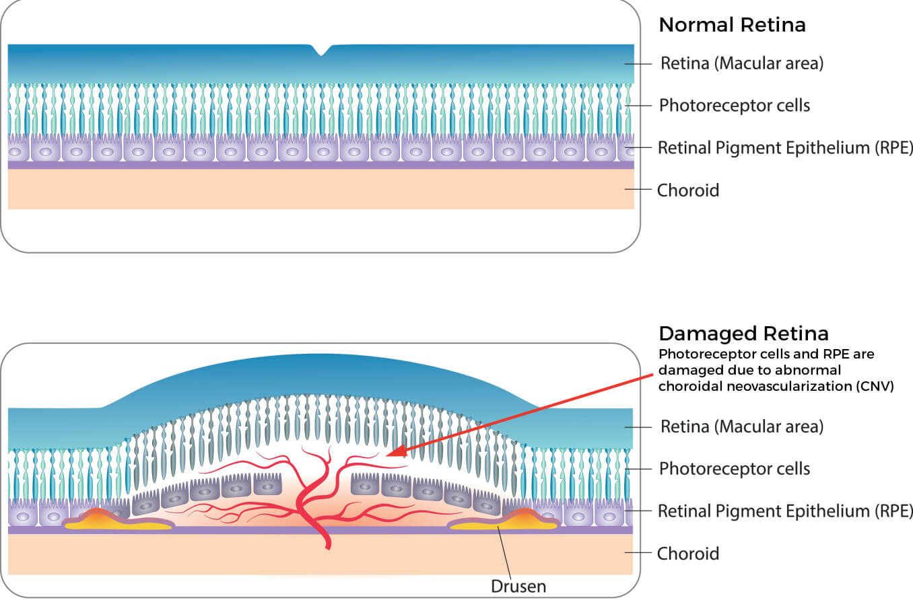
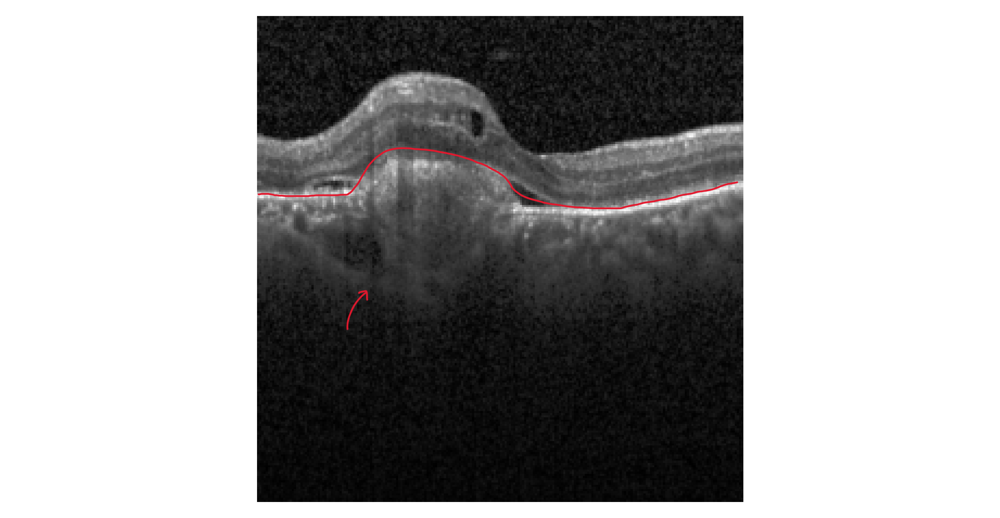

# MAM09A2 - OctMNIST classification experiment. **Conventional machine learning vs a deep learning approach**
## Table of Contents
- [About the dataset](#about-the-dataset)
    - [The different classifications](#the-different-classifications)
        - [choroidal neovascularization (CNV)](#choroidal-neovascularization-cnv)
        - [diabetic macular edema (DME)](#diabetic-macular-edema-dme)
        - [drusen](#drusen)
- [About the methods](#about-the-methods)
  - [Conventional machine learning](#conventional-machine-learning)
  - [Deep learning](#deep-learning)
    - [MultiLayer Perceptron](#multilayer-perceptron)
    - [Convolutional Neural Network](#convolutional-neural-network)
- [About the data splits and preprocessing](#about-the-data-splits-and-preprocessing)
- [Final Evaluation on the Test Set](#final-evaluation-on-the-test-set)
  - [Results](#results)
- [Discussion](#Discussion)
    - [Limitations](#Limitations)
    - [Future implementations](#Future-implementations)
- [How to run](#how-to-run)
  - [Environment setup](#environment-setup)
  - [Downloading the dataset](#downloading-the-dataset)
  - [Training for machine learning](#training-for-machine-learning)
  - [Training for Deep learning](#training-for-deep-learning)


## About the dataset
The dataset consists of 109,309 images of retinal Optical Coherence Tomography (OCT) from the OctMNIST dataset. These are 2D grayscale images and are available in multiple resolutions, however in this project 28x28 will be used. The dataset consists of a Training,Validation,Test split of (97,477 / 10,832 / 1,000). To see the original paper on this dataset see: Kermany D, Goldbaum M, Cai W et al. Identifying Medical Diagnoses and Treatable Diseases by Image-Based Deep Learning. Cell. 2018; 172(5):1122-1131. doi:10.1016/j.cell.2018.02.010. https://www.cell.com/cms/10.1016/j.cell.2018.02.010/asset/17bdc187-16b7-4a49-acea-f982b88d3b89/main.assets/gr2_lrg.jpg
### The different classifications
The dataset contains four classifications: choroidal neovascularization (CNV), diabetic macular edema (DME), drusen and normal. An example from the dataset of each class can be seen below. An explanation and a showcase presentation on OCT of each condition can also be seen below. 


####  choroidal neovascularization (CNV)
This condition occurs when new abnormal vessels grow from the choroid into the retinal pigment epithelium (RPE), see the figure below. On OCT this shows as a localized elevation of the RPE by an hyperreflective mass.

<p float="left">
  
  
</p>

*source:  https://www.allaboutvision.com/conditions/choroidal-neovascularization-cnv/* 

#### diabetic macular edema (DME)
This condition occurs due to leakage from existing retinal capillaries in the macula due to diabetes, see figure below. The leakage causes fluid to build up between the retinal layers, which can be seen on OCT as a spongy structure. 

<p float="left">
  
  
</p>

*source: https://eyewiki.org/Diabetic_Macular_Edema/*

#### drusen
Drusen are extracellular deposits of lipids, proteins and other debris and often presents between bruch's membreme and the RPE, see the figure below. Drusen are a marker and mediator of age-related macular degeneration, since they can cause dysregulation of the RPE. On OCT drusen present as small bumps along the RPE. 

<p float="left">
  
  
</p>

*source: https://www.scienceofamd.org/learn/*

## About the data splits and preprocessing
We use the official MedMNIST train/validation/test splits rather than resampling our own. This preserves comparability with published OCTMNIST benchmarks and, because MedMNIST exposes no patient identifiers, avoids the patient-level leakage that a random image-level re-split would risk (multiple scans from one patient landing in different splits).

The training and validation sets are class-imbalanced (47.2% normal, 34.4% CNV, 10.5% DME, and 8.0% drusen) while the test set is balanced at 250 images per class (25% each). We address the training imbalance through class weighting in the models rather than altering the splits, and we report per-class metrics because the train/test distribution mismatch means overall accuracy alone can hide poor performance on the minority classes.

MedMNIST provides the images already centre-cropped and resized to a fixed square resolution (we use 28×28) with intensities as 8-bit grayscale; "preprocessed" here refers to that standardisation from the original heterogeneous OCT scans. Our pipeline adds only the model-specific steps applied per split: flattening and feature scaling for the classical baseline, and tensor conversion.

## About the methods
*This section gives a short explanation and reasoning for the selected methods for both the machine learning and deep learning approaches. The goal is to be able to evaluate the effectiveness of the deep learning approach by comparing it to the conventional machine learning method.*

### Conventional machine learning

For the conventional machine learning approach a Linear Support Vector Classifier (LinearSVC) was used. Each 28x28 grayscale image is flattened into a single vector of 784 pixel values, which forms the input to the model.

Before classification the pixel values are rescaled with a `MinMaxScaler`, which linearly maps each feature to the range [0, 1] using the minimum and maximum seen in the training data. Scaling matters because a support vector machine positions its decision boundary using distances between points, so the default of feeding raw pixels straight in would let the features with the largest values dominate the margin and distort the fit. `MinMaxScaler` was chosen over the common alternative (`StandardScaler`) because pixel intensities are already bounded and non-negative (0-255): mapping them to [0, 1] preserves that structure and keeps zero pixels at zero, whereas standardising would introduce negative values and assume a roughly Gaussian spread that pixel data does not have. The scaler sits inside a pipeline together with the classifier, so it is fitted on the training data only and the same transformation is reused on the validation and test data.

The LinearSVC then learns a linear decision boundary for each of the four classes in a one-vs-rest fashion, separating each class from the rest with the largest possible margin. A few settings were changed from their defaults. The parameter `class_weight` is set to `"balanced"` rather than the default, which treats every class equally. This scales each class's penalty inversely to how often it appears, so mistakes on the rare classes such as drusen count for more and the model is not pulled towards the common classes. The parameter `dual` is set to `False` instead of letting it be chosen automatically, which solves the primal form of the optimisation rather than the dual. According to scikit-learn's documentation, this is the recommended and faster option when there are many more samples than features, as is the case here with far more images than the 784 pixel features. The parameter `random_state` is fixed to a set value (42) rather than left unseeded, so the solver's internal randomness is deterministic and the same model is produced on every run. Finally, `max_iter` is raised to 3000 from its default of 1000. This represents the cap on the number of solver iterations before it stops, and the higher cap gives the solver enough room to converge on this data, avoiding the convergence warning that the default can produce on the larger train+val refit.

The regularisation strength `C`, which controls the trade-off between a wide margin and misclassifying training points, is the only hyperparameter that is tuned. Four candidate values spanning several orders of magnitude (0.001, 0.01, 0.1, 1.0) are each fitted on the training split and scored on the official validation split, and the value giving the best accuracy is kept, rather than tuning with k-fold cross-validation, since the dataset already provides a dedicated validation set. The model with the best `C` is then refitted on the combined training and validation data, and the held-out test set is scored exactly once using the same shared metrics module as the CNN (accuracy, macro one-vs-rest AUC, macro-F1 and per-class recall), so the two models are directly comparable.

### Deep learning
For the classification task two different Deep Learning archetypes were used, MultiLayer Perceptron and Convolutional Neural Network. The specifics of how the two archetypes are implemented will be discussed in the next sections. The optimizer, loss function and regularization are the same for both experiments. **Optimizer: Adam** (Often used since it is computationally efficient and able to deal with pathological curvatures in the gradient. However, Adam does often tend to find minima that are more extreme and other optimizers such as stochastic gradient descent with momentum often find more flatter minima which is leads to better generalisation), **Loss function: CrossEntropy** (Good for classification due to the shape of the loss function exploding at 0) and **Regularization: Early stopping and L2**. 

#### MultiLayer Perceptron
A MultiLayer Perceptron (MLP) is the simplest for of a neural net. Ours consist of two fully connected ReLu layers. With the first layer containing 512 hidden units and the second layer containing 256 hidden units. These numbers were chosen in order to roughly match the amount of weights in the CNN running on 28x28 images. 

#### Convolutional Neural Network
For the deep learning approach a Convolutional Neural Net (CNN) was used. It consists of a simple architecture of two feature extraction blocks (nn.Conv2d + nn.ReLU + nn.MaxPool2d) and a classifier block (nn.Flatten + nn.Linear + nn.ReLU + nn.Linear). See below for an overview of the architecture. 


The feature extraction blocks finds features within the image, in this case set to 32 at the first block and 64 at the second. These are patterns in the images that are learnt, for instance lines, shapes etc. For a single image you can extract these features and see them in a feature map, see image below. This is what makes CCNs particularly good at tasks with images, since any shifts or rotations of the shapes will not affect the performance. For instance, a shift or rotation will drasticly impact the performance of a MLP since it has never seen such a combination of pixels. However, a CNN still recognizes the shapes and structures in the images since its learnt the kernels that are able to find these patterns in the images. 

**Feature map of class: CNV**
<p float="left">
  
  
</p>

**Feature map of class: DME**
<p float="left">
  
  
</p>

**Feature map of class: drusen**
<p float="left">
  
  
</p>

**Feature map of class: Normal**
<p float="left">
  
  
</p>

**Hyperparameters:**
| Hyperparameter | MLP | CNN |
|---|---|---|
| Learning Rate | 1e-3 | 1e-3 |
| L2 lambda | 1e-4 | 1e-4 |
| Batch size | 64 | 64 |

## Final Evaluation on the Test Set

Both models are evaluated on the official MedMNIST test set (1,000 images,
250 per class), used exactly once after all model selection and tuning is
complete. The same evaluation code and the same metrics are applied to both
models, so the comparison is like-for-like.

We report four metrics:

- **Accuracy (ACC)** - the fraction of test images classified correctly. A
  MedMNIST standard metric, so it is directly comparable to published OCTMNIST
  benchmarks; because the test set is balanced, it is not skewed toward any
  single class.
- **AUC** - area under the ROC curve (one-vs-rest). It is
  threshold-independent, measuring how well the model ranks each class against
  the rest rather than judging a single hard decision. Also a MedMNIST standard
  metric, included for comparability.
- **Macro-F1** - the harmonic mean of precision and recall, averaged equally
  across the four classes. Unlike accuracy, it penalises a model that
  over-predicts the majority classes, so it captures minority-class failure in
  a single number. (Micro-F1 is not reported separately, as it is equal to
  accuracy for single-label classification.)
- **Per-class recall** - for each disease, the fraction of its true cases the
  model identified. This is our diagnostic metric: it shows precisely which
  classes are handled well and which are missed, which the aggregate scores
  cannot reveal.

The first two provide comparability with the MedMNIST benchmark; the last two
expose the per-class behaviour that matters given the class imbalance in the
training data.

### Results

| Metric | LinearSVC baseline (c = 1.0) | CNN |
|---|---|---|
| Accuracy (ACC) | 0.3510 | 0.6780 |
| AUC (OvR) | 0.6271 | 0.9229 |
| Macro-F1 | 0.2560 | 0.6434 |

**The state of the art model for this classification task is currently ResNet-50 (28x28) and has an ACC of 0.762. Our initial simple CNN already reaches 90.0% of the performance compared to the state of the art**

Per-class recall:

| Class | LinearSVC baseline (c = 1.0) | CNN |
|---|---|---|
| CNV | 0.7760 | 0.9640 |
| DME | 0.0400 | 0.6200 |
| drusen | 0.0160 | 0.2120 |
| normal | 0.5720 | 0.9160 |

The learning loss and accuracy curves on the validation set can be found in reports/..._learning_curves.png

## Discussion 
It is clear that the best performing model all round is the CNN. 

The reason the CNN outperforms the LinearSVC baseline so decisively is structural rather than a  matter of tuning. The baseline is a linear classifier on raw, flattened pixels, meaning it has no notion of spatial locality or translation invariance, so it can only separate classes that differ by large, position-stable intensity patterns. That is exactly why it performs better on CNV and normal (recall 0.78 and 0.57) but effectively ignores DME and drusen (recall 0.04 and 0.02): it has collapsed into a two-class detector. The CNN's convolutions, by contrast, learn local texture features that are reused across the image, which is precisely what the harder classes require: moving from the baseline to the CNN lifts DME recall from 0.04 to 0.62 and drusen from 0.02 to 0.21. This also answers *under what conditions the neural network helps*: it helps most where the discriminative signal is local texture rather than global intensity.

Interesting to note is the performance on drusen, it seems to be low on all models. We expect this to be due to the amount of available training images on this class and the difficulty of the task. Since drusen is not necessarily a pathology on its own and mainly a hallmark of age related macular degeneration it is possible to occur simultaneously with other conditions. This overlap makes the classification task alot harder, additionally the structure of how a drusen presents could bring difficulties. All the other pathologies have clear large hallmarks, but drusen appear as small dots on the scan and can be easily confused for other normal structures in a OCT scan or as part of structures within other pathologies. For instance, the spongey texture of DME also contain circulair structures which are not drusen. This makes the task increasingly difficult. Another point of this structure is the size of the drusen, given the training is performed on the low resolution images 28x28 and for the convolution later 14x14 and 7x7 in the later layers, the entire structure might be averaged out and disappear. 

### Limitations

- **Preprocessing is not symmetric across the two models.** The LinearSVC pipeline scales its inputs to [0, 1] via `MinMaxScaler`, but the deep-learning dataset feeds raw 0–255 pixel values to the network. The *evaluation* protocol is shared, but the input preprocessing is not, which is a caveat on the strict "like-for-like" comparison.
- **The CNN has no normalisation or regularisation layers** (no BatchNorm, no Dropout) beyond weight decay, and uses a fixed learning rate with no scheduler.
- **Early stopping monitors validation loss**, not the metric we actually report (AUC / accuracy); on imbalanced data these can diverge, so the checkpointed model is "best" by loss rather than by the reported metric.
- **Reproducibility is only partially pinned.** Global seeds are set, but the training `DataLoader` shuffles with multiple workers without a fixed generator, and cuDNN determinism is not enforced, so runs are not bit-reproducible.
- **Results are from a single seed and a single test pass**, with no error bars.


### Future implementations

- **Weight the CNN loss by class frequency** (or use a weighted sampler), mirroring the baseline's `class_weight="balanced"`, and report whether this moves drusen/DME recall - this would isolate the imbalance effect from the resolution effect.
- **Normalise the network inputs** so preprocessing matches the baseline.
- Build a **stronger, fairer baseline**: e.g., PCA-whitened features feeding a linear or RBF SVM.
- **Repeat the CNN over several seeds** to obtain error bars on the reported metrics.
- Proper **hyperparameter tuning for the CNN**.
- **Training on the higher-dimension images** (requires changes to the architecture and possibly the regularisation), which directly addresses the resolution hypothesis for drusen.
- **Creation of synthetic data** to create a more equal class distribution.
- Add **BatchNorm, Dropout, and a learning-rate scheduler**, and switch early stopping to monitor the reported metric.


## How to run

The project can be run on the UvA Snellius cluster (GPU) or on a local
machine (CPU). Follow the section matching your setup.

In both cases, **run every command from the repository root** so that the
relative paths inside the scripts resolve correctly.

### A. Snellius cluster

Two of the steps below need internet access and must be run **directly on a
login node** (the shell you get right after `ssh`), not submitted with
`sbatch`. Compute nodes have no internet, so submitting these would fail.
The two training steps are the opposite: they are submitted with `sbatch`
to run on compute nodes.

#### 1. Get the repository
SSH into Snellius, then clone this repository into your home directory:
```
git clone https://github.com/LMASchalk/MAM09A2.git ~/MAM09A2
```

#### 2. Environment setup (login node)
```
bash src/bashrunscripts/setup_env.sh
```
This creates the `dl_gpu` conda environment from `dl_gpu.yml`. A harmless SURF
warning about conda may appear. This step takes a while.

#### 3. Download the dataset (login node)
```
bash src/bashrunscripts/make_dataset.sh
```
Run this once. The dataset is then cached locally and read offline by the
training jobs.

#### 4. Train the machine learning baseline (compute node)
```
sbatch src/bashrunscripts/fit_linearSVC.job
```

#### 5. Train the deep learning model (compute node)
```
sbatch src/bashrunscripts/fit_deeplearning.job
```

### B. Local machine (no cluster)

**Prerequisite:** a working conda installation (Miniconda or Anaconda) that
is initialized in your shell. If `conda` is not found, install Miniconda
first (https://www.anaconda.com/docs/getting-started/miniconda/install/overview), open a new terminal, and continue. The setup script checks for this and will tell you
if conda is missing. `conda` has to be placed in your PATH.

The login-node / compute-node distinction does not apply locally: your
machine has internet throughout, so every step is a normal `bash` run.

#### 1. Get the repository
```
git clone https://github.com/LMASchalk/MAM09A2.git
cd MAM09A2
```

#### 2. Environment setup
```
bash src/bashrunscripts/setup_env.sh
```
This creates the `dl_cpu` conda environment from `dl_cpu.yml`.

#### 3. Download the dataset
```
bash src/bashrunscripts/make_dataset.sh
```

#### 4. Train the machine learning baseline
```
bash src/bashrunscripts/fit_linearsvc.sh
```

#### 5. Train the deep learning model
```
bash src/bashrunscripts/fit_deeplearning.sh
```
This runs on CPU. At 28x28 it is slow but adequate for verifying the
pipeline end to end before moving to the cluster for a full run.
